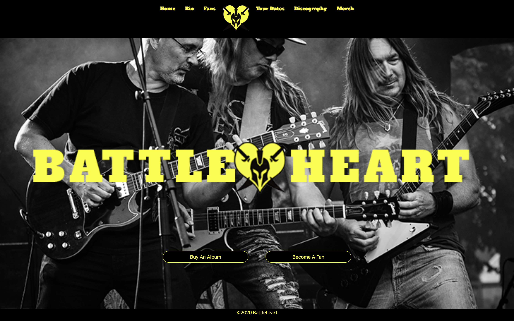

# Battleheart Band Website

## Description
This project was our cohort’s first group project and our introduction to using Github for project planning, planning out development tickets, writing user stories and development notes, and tracking each ticket throughout the development cycle. This project was also an exercise in managing different team members’ code in the same codebase and handling the conflicts that inevitably came up throughout the project. For this project, we built a website for a music band, using Bootstrap, CSS, HTML, and Javascript, and learning how to manage calls for multiple HTML pages in a single Javascript file.

## Background
Project instructions can be found here: https://github.com/nss-evening-cohort-11/bands-battleheart/blob/master/instructions.md.
This project gave us the opportunity to learn how to use Github for managing real-life projects with multiple developers working on the same project - how to review another programmer’s code, how to provide feedback and work through issues together, the importance of keeping up with colleagues’ new code so that one doesn’t have a huge number of conflicts after you do not merge through too many of your colleagues’ pull requests.
We also learned how to manage our CSS code in a single file, how to prevent issues by planning naming conventions beforehand so that we do not overlap one another’s and how to reduce redundancy where possible.
We used CSS Flexbox for organizing our data, such as the biography cards, and For loops and template literals for displaying the data dynamically. 

## Screenshots
##### Home Page

##### Bio Page

###### Fans Page

###### Tour Page

###### Discography Page

## Technologies & Tools
Bootstrap, CSS, Github, HTML5, Vanilla Javascript

## Contributors
* David Everett
* Kenneth McEastland
* Anca Simon

## How to Run
1. Clone down this repo.
1. Make sure you have http-server installed via npm. If not, get it [here](https://www.npmjs.com/package/http-server).
1. On your command line, run `hs -p 9999`.
1. In your browser, navigate to `http://localhost:9999`.

